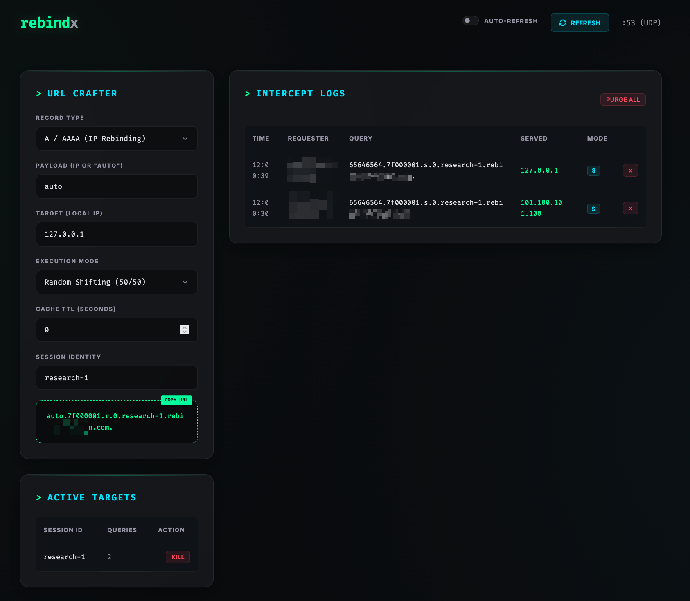

# rebindx


A high-performance, programmable DNS rebinding tool for security researchers. `rebindx` allows you to create dynamic DNS responses that shift between multiple IP addresses based on configurable patterns, ideal for looking for SSRF and other issues.

## Features

* **Multi-Mode Shifting**:
  * `r`: Random (50/50 selection)
  * `i<seconds>`: Interval (Shift once after X seconds)
  * `ir<seconds>`: Interval Rotate (Flip back and forth every X seconds)
  * `t<count>`: Threshold (Shift once after X queries)
  * `tr<count>`: Threshold Rotate (Flip back and forth every X queries)
  * `s`: Sequential rotation (Every query)
  * `both`: Multi-record response (returns both IPs)

* **Programmable Controls**:
  * **TTL Control**: Specify TTL per-query.
  * **"My IP" Detection**: Use `auto` to dynamically resolve to the requester's IP.
  * **Response Codes**: Control DNS RCode (NXDOMAIN, SERVFAIL, etc.) via `rc<code.>`.
  * **CNAME Support**: Rebind CNAME targets instead of IP addresses.
  * **IPv6 Support**: Full AAAA record support.
* **Web Dashboard**: A real-time dashboard for log monitoring and URL generation.

## Server Firewall Setup

Your firewall rules should look like this:

* Allow SSH (not required if you are not accessing your server via SSH)

```bash
sudo ufw allow 22/tcp
```

* Allow UDP port 53 (For DNS)

```bash
sudo ufw allow 53/udp
```

* Allow TCP port 8080 (For Dashboard/ You may have to change this if you change your dashboard port.)

```bash
sudo ufw allow 8080/tcp
```

| Protocol | Port | Source    |
| -------- | ---- | --------- |
| TCP      | 22   | 0.0.0.0/0 |
| UDP      | 53   | 0.0.0.0/0 |
| TCP      | 8080 | 0.0.0.0/0 |

## Quick Start

**Without Docker:**

```bash
go build -o rebindx main.go
```

```bash
sudo ./rebindx -domain rebindx.yourdomain.tld -user DashboardUsername -pass DashboardPassword
```

**Using Docker:**

```bash
sudo docker build -t rebindx .
```

```bash
sudo docker run -d -p 53:53/udp -p 8080:8080 rebindx -domain rebindx.yourdomain.tld -user DashboardUsername -pass DashboardPassword
```

### Configuring your domain DNS records

You should add the following DNS records to yourdomain.tld

| Type | Name                   | Value              | Notes                     |
| ---- | ---------------------- | ------------------ | ------------------------- |
| A    | ns1.yourdomain.tld     | serverip           | Disable proxy if required |
| A    | ns2.yourdomain.tld     | serverip           | Disable proxy if required |
| NS   | rebindx.yourdomain.tld | ns1.yourdomain.tld | Delegates subdomain       |
| NS   | rebindx.yourdomain.tld | ns2.yourdomain.tld | Delegates subdomain       |

### 3. Usage

Access the dashboard at `http://ns1.yourdomain.tld:8080` (user: `DashboardUsername`, pass: `DashboardPassword`).

The dashboard will look like this:



From the web dashboard you can:

1. Craft URLS based on your needs
1. See and purge logs
1. See and delete sessions

### Full Options

| Flag | Description | Default |
| :--- | :--- | :--- |
| `-domain` | Base domain for rebinding | (Required) |
| `-pass` | Dashboard password (enables Basic Auth) | "" |
| `-user` | Dashboard username (when -pass is set) | "admin" |
| `-port` | Dashboard HTTP port | 8080 |
| `-ip` | DNS server listen IP | 0.0.0.0 |

## Debugging

### PORT 53 is already in use

In some machines you might need to turn off DNSStubListener. Which is used to listen on port 53.

```bash
sudo nano /etc/systemd/resolved.conf
```

Change `DNSStubListener=yes` to `DNSStubListener=no`.
Remove # if present

Restart the service

```bash
sudo systemctl restart systemd-resolved
```

## License

MIT
